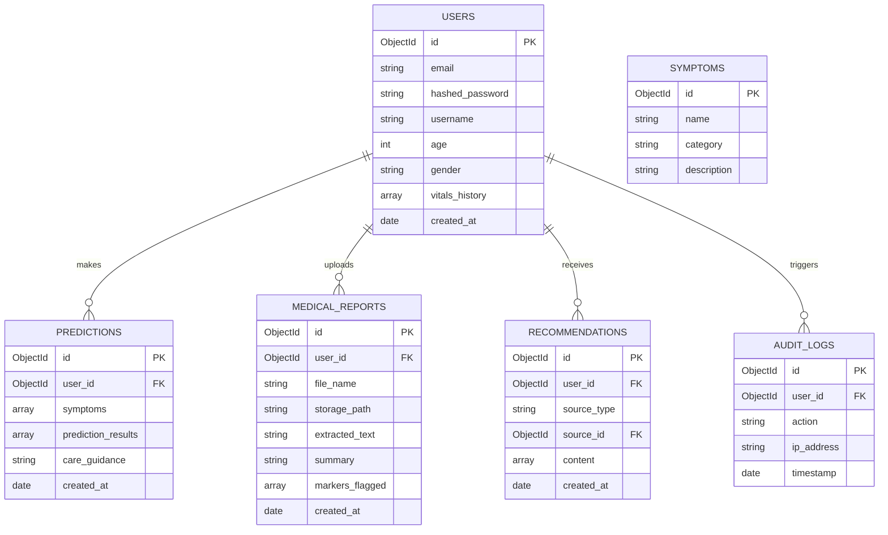

# Phase 3 — Database Design: AI-Powered Smart Healthcare Assistant

This document defines the MongoDB collections, relationships, indices, schema validation, and optimization guidelines.

---

## 1. Schema Design & ER Diagram

MongoDB is a document-oriented database. While schema-less by nature, we maintain logical relationships using document references (e.g. `user_id` links).



---

## 2. Collection Schemas & Sample Documents

### Users Collection
* **Description**: Holds user accounts, profile fields, and history of key health vitals.

#### Sample Document:
```json
{
  "_id": {"$oid": "64a4b27ef3e218206d860d10"},
  "email": "patient.doe@example.com",
  "hashed_password": "$2b$12$EixZaYVK1fsblahblahhashedpassword",
  "username": "patientdoe",
  "age": 34,
  "gender": "male",
  "vitals_history": [
    {
      "heart_rate": 78,
      "blood_pressure": "120/80",
      "blood_sugar": 105,
      "bmi": 22.4,
      "recorded_at": {"$date": "2026-06-20T10:00:00Z"}
    }
  ],
  "created_at": {"$date": "2026-06-20T08:00:00Z"}
}
```

### Predictions Collection
* **Description**: Records symptom check queries and ML model outputs.

#### Sample Document:
```json
{
  "_id": {"$oid": "64a4b2a8f3e218206d860d12"},
  "user_id": {"$oid": "64a4b27ef3e218206d860d10"},
  "symptoms": ["itching", "skin_rash", "nodal_skin_eruptions"],
  "prediction_results": [
    {"disease": "Fungal infection", "confidence": 0.94},
    {"disease": "Allergy", "confidence": 0.05}
  ],
  "care_guidance": "Consult a dermatologist. Maintain dry skin surfaces.",
  "created_at": {"$date": "2026-06-20T10:15:00Z"}
}
```

### Medical Reports Collection
* **Description**: Stores results of OCR extraction and parsed markers from medical PDFs/images.

#### Sample Document:
```json
{
  "_id": {"$oid": "64a4b2c1f3e218206d860d14"},
  "user_id": {"$oid": "64a4b27ef3e218206d860d10"},
  "file_name": "blood_panel_2026.pdf",
  "storage_path": "/app/uploads/blood_panel_2026.pdf",
  "extracted_text": "Patient Name: Patient Doe... Cholesterol: 240 mg/dL... HbA1c: 5.6%...",
  "summary": "Blood report indicates elevated total cholesterol levels.",
  "markers_flagged": [
    {
      "name": "Cholesterol",
      "value": 240,
      "unit": "mg/dL",
      "reference_range": "100-200",
      "status": "high"
    }
  ],
  "created_at": {"$date": "2026-06-20T10:20:00Z"}
}
```

### Recommendations Collection
* **Description**: Holds structured recommendations generated by rule template systems or LLMs based on predictions and reports.

#### Sample Document:
```json
{
  "_id": {"$oid": "64a4b2fef3e218206d860d16"},
  "user_id": {"$oid": "64a4b27ef3e218206d860d10"},
  "source_type": "report",
  "source_id": {"$oid": "64a4b2c1f3e218206d860d14"},
  "content": [
    {
      "category": "Diet",
      "advice": "Incorporate soluble fibers (oats, legumes) and reduce saturated fats to lower cholesterol."
    },
    {
      "category": "Activity",
      "advice": "Engage in 30 minutes of moderate aerobic exercise daily."
    }
  ],
  "created_at": {"$date": "2026-06-20T10:21:00Z"}
}
```

### Audit Logs Collection
* **Description**: Tracks user actions to maintain application integrity and security.

#### Sample Document:
```json
{
  "_id": {"$oid": "64a4b35ff3e218206d860d18"},
  "user_id": {"$oid": "64a4b27ef3e218206d860d10"},
  "action": "UPLOAD_MEDICAL_REPORT",
  "ip_address": "192.168.1.5",
  "timestamp": {"$date": "2026-06-20T10:20:00Z"}
}
```

---

## 3. Indexing Strategy

To keep database retrieval fast, we configure these indexes:

1. **Users.email (Unique)**:
   * `db.users.createIndex({ "email": 1 }, { unique: true })`
   * *Purpose*: Fast login search; ensures no duplicate accounts.
2. **Predictions.user_id + created_at**:
   * `db.predictions.createIndex({ "user_id": 1, "created_at": -1 })`
   * *Purpose*: Accelerates retrieving history lists.
3. **MedicalReports.user_id**:
   * `db.medical_reports.createIndex({ "user_id": 1 })`
   * *Purpose*: Fast access to a user's uploaded documents.
4. **AuditLogs.timestamp**:
   * `db.audit_logs.createIndex({ "timestamp": 1 }, { expireAfterSeconds: 2592000 })`
   * *Purpose*: TTL index to automatically clean up logs after 30 days.

---

## 4. Optimization Strategy

* **Paging History**: Use `.skip()` and `.limit()` on queries alongside sorting.
* **Projections**: Avoid retrieving full `extracted_text` in medical reports when rendering historical dashboard summary list. Retrieve only name, summary, and date.
* **Sub-document growth control**: Limit the array length of `vitals_history` on the user document (e.g. keep last 100 entries, prune or shift off older logs when appending).

---

## 5. Schema Validation Rules (MongoDB `$jsonSchema`)

```javascript
db.createCollection("users", {
   validator: {
      $jsonSchema: {
         bsonType: "object",
         required: [ "email", "hashed_password", "username", "created_at" ],
         properties: {
            email: {
               bsonType: "string",
               pattern: "^[a-zA-Z0-9._%+-]+@[a-zA-Z0-9.-]+\\.[a-zA-Z]{2,}$",
               description: "must be a valid email format and is required"
            },
            username: {
               bsonType: "string",
               minLength: 3,
               description: "must be a string of at least 3 characters"
            },
            age: {
               bsonType: "int",
               minimum: 0,
               maximum: 120
            }
         }
      }
   }
});
```
