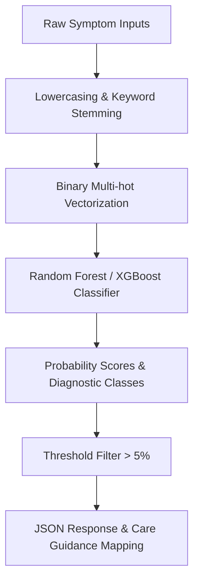

# Phase 6 — Machine Learning Pipeline Design: AI-Powered Smart Healthcare Assistant

This document outlines the machine learning architecture, feature representation, evaluation strategies, and version tracking rules.

---

## 1. Machine Learning Architecture Overview

Our ML system classifies sparse binary symptom vectors into distinct diagnostic labels.

---

## 2. Feature Engineering & Preprocessing
* **Symptom Standardization**: Symptoms are normalized to lower-case, snake_case strings (e.g. "Skin Rash" becomes `skin_rash`).
* **Multi-hot Vectorization**: An input array of symptoms is matched against a static library of `M` known symptoms, yielding a binary array of shape `(1, M)` where `1` indicates symptom presence and `0` indicates absence.

---

## 3. Model Architectures & Selection

We evaluate and deploy two models for tabular classification:
1. **Random Forest Classifier**:
   * *Strengths*: Highly robust against over-fitting, non-parametric, requires minimal scaling, outputs clean probability estimators.
   * *Use*: Main diagnostic classifier.
2. **XGBoost Classifier**:
   * *Strengths*: Excellent gradient-boosting speeds, high performance on non-linear boundaries.
   * *Use*: Alternative model option for complex secondary datasets.

---

## 4. Hyperparameter Tuning & Validation
* **Validation Split**: 80/20 train-test split.
* **Tuning Grid Search**:
  * Random Forest: Tuning `n_estimators` (50, 100, 200), `max_depth` (10, 20, None), and `min_samples_split` (2, 5).
  * XGBoost: Tuning `learning_rate` (0.01, 0.1, 0.2), `max_depth` (3, 6, 9), and `n_estimators` (100, 200).

---

## 5. Model Serving & Versioning
* **Serving**: Loaded on startup into memory using standard Python `pickle`. If model files are missing, the server falls back to dictionary keyword matching rules (guaranteeing service availability).
* **Versioning**: Models are tagged with versions (e.g., `model_v1.0.pkl`) and saved along with the feature list pickles to maintain consistency.
