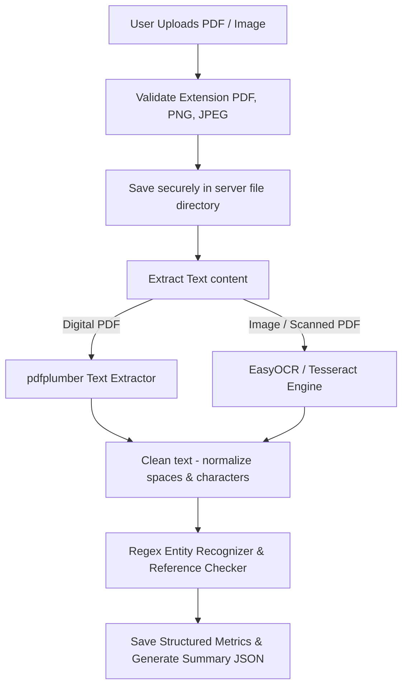

# Phase 9 — Medical Report Analysis: AI-Powered Smart Healthcare Assistant

This document outlines the design and parsing pipeline for extracting text from clinical reports and extracting medical entities from unstructured data.

---

## 1. Document Extraction Pipeline

The report pipeline processes files through several validation and ingestion steps:

---

## 2. Text Extraction Methods
* **Digital PDFs**: Extracted using the python package `pdfplumber`, which scans structured digital font maps directly. This is fast, highly accurate, and has zero external OS binary dependencies.
* **Scanned Reports & Images**: Processed via `easyocr` (deep learning-based OCR) or standard `Tesseract OCR` depending on active containers.
* **Text Normalization**: Strips non-ASCII characters, collapses excessive whitespace, and standardizes numbers.

---

## 3. Entity Classification (Medical NER)
* **Entities Targets**: Health markers, values, units, and ranges (e.g. *Glucose*, *110*, *mg/dL*).
* **Regex Engine**: Employs lookahead matching configurations to associate blood panels, urinalyses, and vitals keywords with adjacent float markers.
* **Normal Bounds Checks**: Values are compared against clinical guidelines (e.g., normal cholesterol is `100.0 - 200.0 mg/dL`). High or low deviations are cataloged into status tags (`high`, `low`).
* **Summary Generation**: Summarizes findings by aggregating all flagged markers into user-friendly diagnostic notices.
