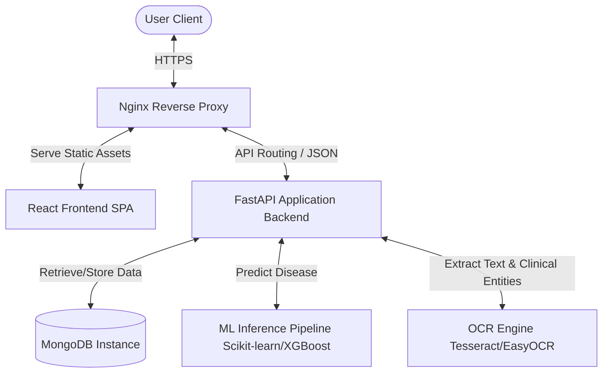
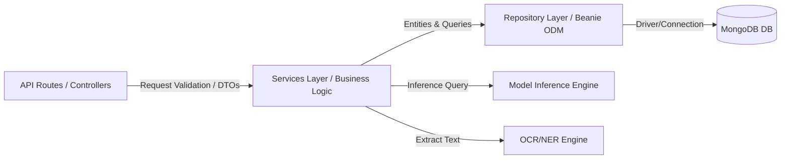
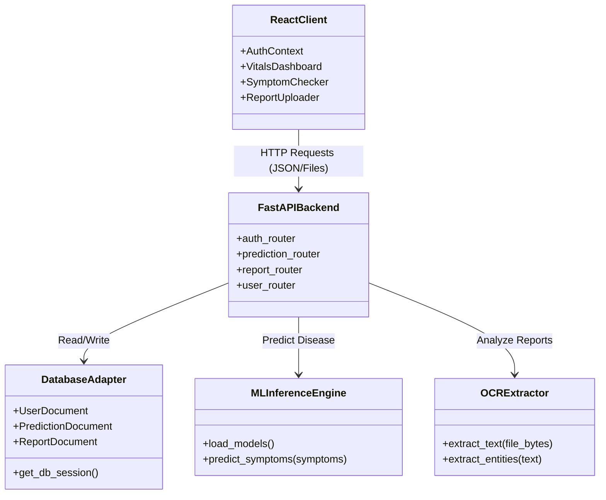
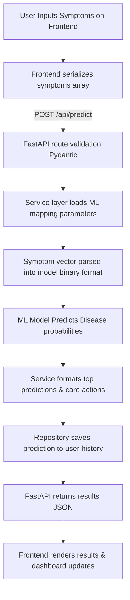
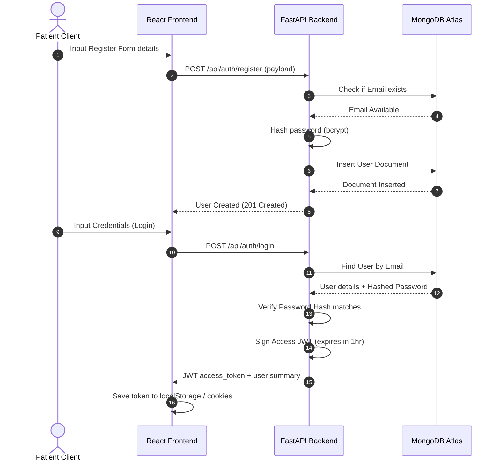
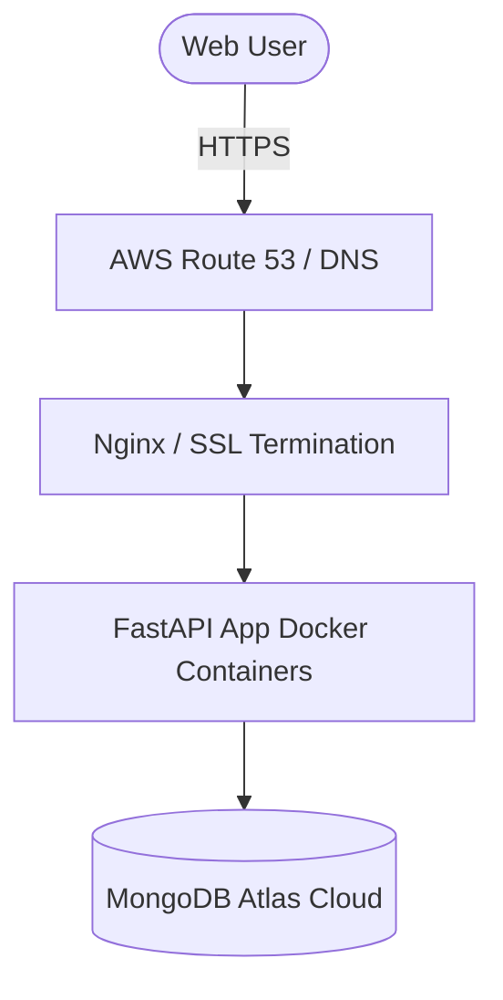

# Phase 2 — System Design: AI-Powered Smart Healthcare Assistant

This document outlines the architecture, component interaction, data flows, and security guidelines for the Smart Healthcare Assistant.

---

## 1. High-Level Architecture

The platform uses a classic 3-tier client-server structure: a Single Page Application (SPA) client, a FastAPI gateway serving APIs, and a MongoDB database, with external containerized modules for OCR and ML inference tasks.

---

## 2. Low-Level Architecture

The FastAPI backend is structured modularly following clean code guidelines:

---

## 3. Component Diagram

---

## 4. Data Flow Diagram

This diagram displays the process when a user inputs symptoms to receive a disease prediction:

---

## 5. Sequence Diagram

This sequence diagram illustrates the user registration and JWT authentication loop:

---

## 6. Service Communication
* **Frontend-to-Backend**: Communicates exclusively through synchronous REST APIs over HTTPS.
* **Backend-to-DB**: Uses asynchronous drivers (Motor) via Beanie ODM.
* **Internal ML/OCR engines**: Processed in a blocking or asynchronous ThreadPool executor inside FastAPI to ensure the event loop is never blocked by compute-heavy task evaluations.

---

## 7. Authentication Flow
Authentication is managed via HTTP Bearer tokens.
1. Frontend attaches the token in request headers: `Authorization: Bearer <JWT_TOKEN>`.
2. Backend middleware validates token signature using the HS256 algorithm and a shared `SECRET_KEY`.
3. If token is invalid or expired, backend answers with a `401 Unauthorized` response code, and the frontend redirects the user to the login screen.

---

## 8. Security Architecture
* **Transport Layer Security**: HTTPS enforced for all client-server communication.
* **Cross-Origin Resource Sharing (CORS)**: backend strictly restricts origins to trusted client hosts.
* **Password Security**: Standard bcrypt hashing algorithm.
* **Pydantic Validation**: Strips extra payload elements to prevent parameter pollution or injection issues.

---

## 9. Scalability Design
* **Stateless API Services**: The FastAPI containers are stateless, allowing for simple horizontal load balancing (via AWS ECS or Kubernetes).
* **Connection Pooling**: Reuses MongoDB connections to avoid handshake costs on each API call.
* **ML Serving Isolation**: Machine learning tasks can be isolated into dedicated Docker containers running Celery tasks or TorchServe instances when scale demands.

---

## 10. Deployment Architecture

